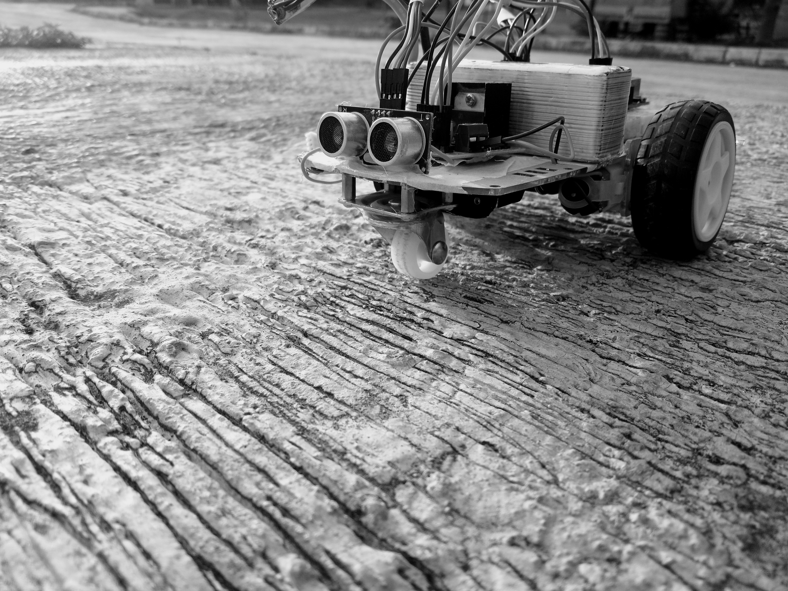

# 🤖 Obstacle Avoidance Robot Using Arduino
This repository contains the implementation of the project titled _"Obstacle Avoidance Robot Using Arduino"_, at the Department of Mechatronics Engineering (DOME), Federal University of Technology Minna (FUTMinna), Nigeria.

---

## 🔍 Project Overview

This project focuses on the design and development of an obstacle-avoidance robot using Arduino. The robot was programmed to detect and avoid obstacles autonomously using an ultrasonic distance sensor that measures the proximity of 
surrounding objects. When an obstacle is detected within a predefined range, the Arduino microcontroller processes the input and triggers a change in the robot’s motion: stopping, turning, or rerouting to prevent collision.

---

## 🚀 Project Objective

- To develop and program a robot capable of detecting and avoiding obstacles autonomously.

---

## 🧰 Tools | Components Used

| Component / Tool | Purpose in Project |
|------------------|--------------------|
| **Arduino Uno** | Served as the central microcontroller that coordinated sensor inputs and motor outputs. |
| **HC-SR04 Ultrasonic Sensor** | Detected obstacles by measuring the distance between the robot and nearby objects. |
| **L298N Motor Driver Module** | Controlled the direction and speed of the DC motors based on Arduino signals. |
| **DC Motors (x2)** | Powered the robot’s movement by enabling forward, backward, and turning actions. |
| **Robot Chassis** | Provided a stable structure to mount and hold all electronic components. |
| **Wheels (x2)** | Enabled the robot to move across surfaces smoothly. |
| **Caster Wheel** | Supported the robot’s balance and assisted in smooth directional changes. |
| **Jumper Wires** | Connected various components electrically to ensure proper signal and power transmission. |
| **Breadboard** | Provided a platform for connecting circuit components without soldering. |
| **Power Supply** | Supplied the required electrical power to the Arduino and motors. |
| **Arduino IDE** | Was used to write, compile, and upload the obstacle avoidance program to the Arduino board. |

## 🪜 Step-by-Step Procedure

1. **Prepared components:**  
   All hardware parts (Arduino Uno, HC-SR04, L298N motor driver, DC motors, wheels, caster, battery pack, jumper wires, breadboard, chassis) were gathered and inspected for visible damage.

2. **Built the circuit:**  
   The components were mounted on the chassis and wired: ultrasonic sensor to designated Arduino pins (`6` and `7` specifically), motor driver to Arduino control pins and motors, and battery pack to the motor driver and Arduino power input.

3. **Performed hardware pre-checks:**  
   - The battery voltage was measured to confirm proper charge and stable output.  
   - Motor continuity and free rotation were checked manually to ensure no binding.  
   - Jumper wires and breadboard connections were verified for tight contact and correct routing.  
   - Sensor pins and motor driver connections were confirmed against the wiring diagram.

4. **Tested individual subsystems:**  
   - The ultrasonic sensor was tested with a simple sketch to confirm correct distance readings.  
   - Each motor was powered briefly through the motor driver to verify direction and speed response.  
   - The motor driver control pins were toggled to ensure proper enable/disable behavior.

5. **Prepared and Uploaded the code:**  
   This involved the following
   - Initializing motor control pins and ultrasonic sensor pins while starting serial communication for debugging.
   - Pulsing the `HCS-R04` trigger pin, measuring the echo pulse and converting the echo time to distance.
   - The code then compared this distance against a fixed threshold of `10 cm`, and if found less, invoked the avoidance routine, otherwise it commmanded forward motion.
   - When an obstacle was detected within `10 cm`, the code reduced the motor PWM to 75 on both channels, reversed one motor and forwarded the other to effect a right turn, maintained that turning command for 0.5 seconds before restoring forward driving motion.
     
    The code continued this loop behavior by sensing deciding and carry out act cycles. After this, the control  program sketch was compiled and uploaded to the Arduino using the Arduino IDE while the board was connected to the computer.

7. **Performed integration test:**  
   With the robot powered (battery pack connected), the full program was run and the robot’s high-level behavior (move forward, detect obstacle, turn/avoid) was observed.

8. **Calibrated thresholds and timings:**  
   Distance threshold, motor speeds (PWM values), and turn durations were tuned iteratively to produce stable forward motion and avoid overly sharp maneuvers.

9. **Observed responses and refined outcomes:**  
    Next, observations such as successful avoidance, false triggers, and turning radius were noted which prompted the modification of code parameters and wirings were to address issues observed.

10. **Final validation:**  
    Finally, the robot was tested across different obstacle sizes and surfaces to validate its obstacle avoidance behavior | capability before recording the outcomes and committing the final code to the repository.

---

## 🎥 Demo

    
     
    <em> The Obstacle Avoidance Robot in Motion</em>

### 📷 Robot Front View

    
     
    <em> Front View of the Robot</em>

### 📷 Robot Side View

    
     
    <em> Side View of the Robot</em>

---

## ⚠️ Challenges Encountered

The main challenge encountered was calibrating the motor speeds and movements to ensure smooth and stable turns, as the robot initially made abrupt movements whenever an obstacle was detected

---

